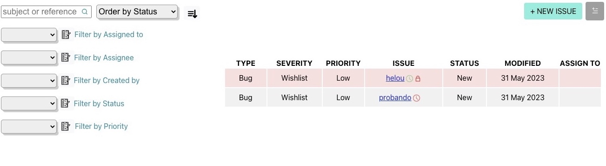
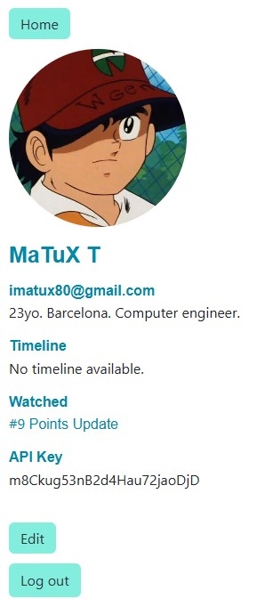
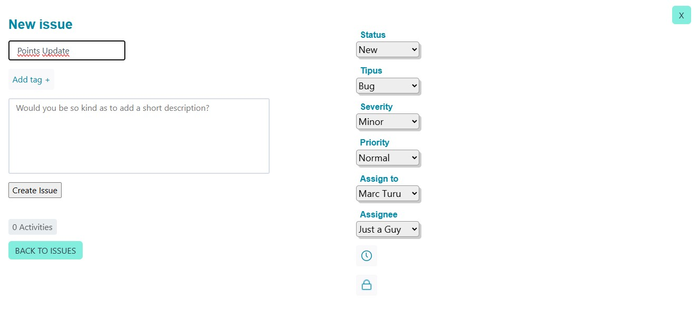
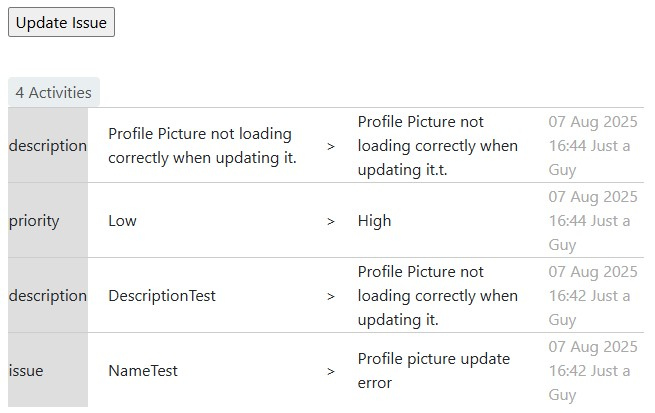
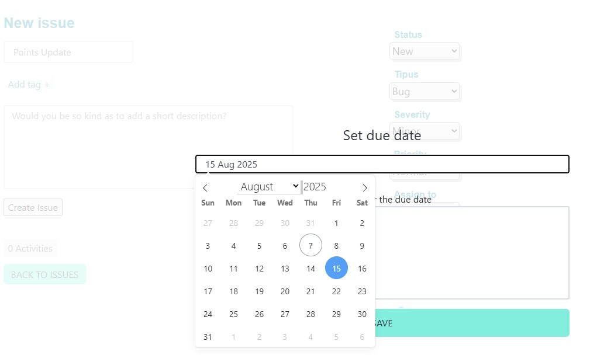
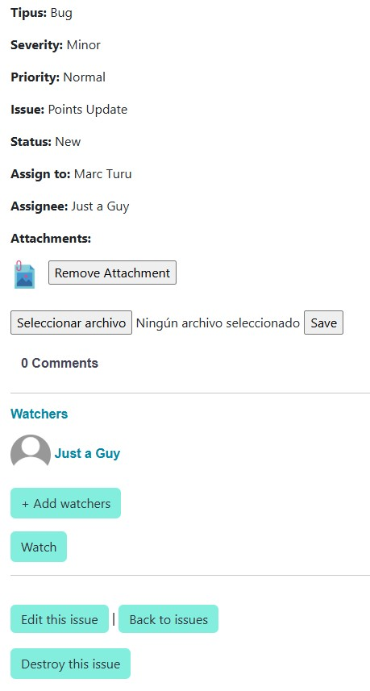
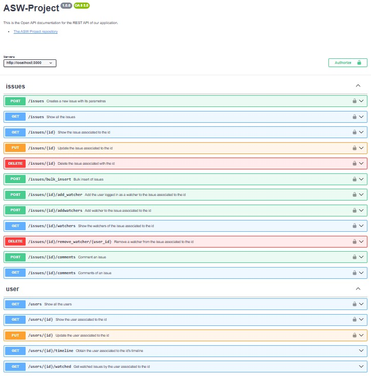
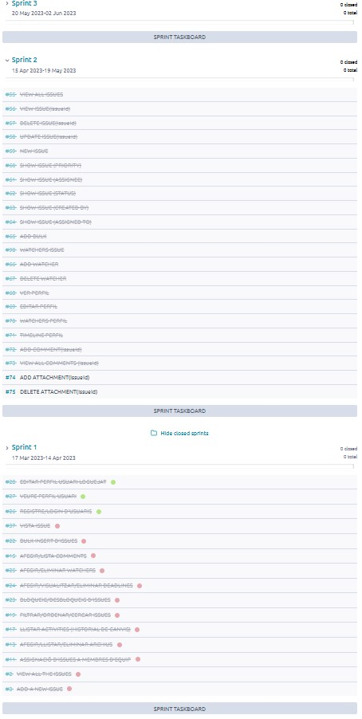
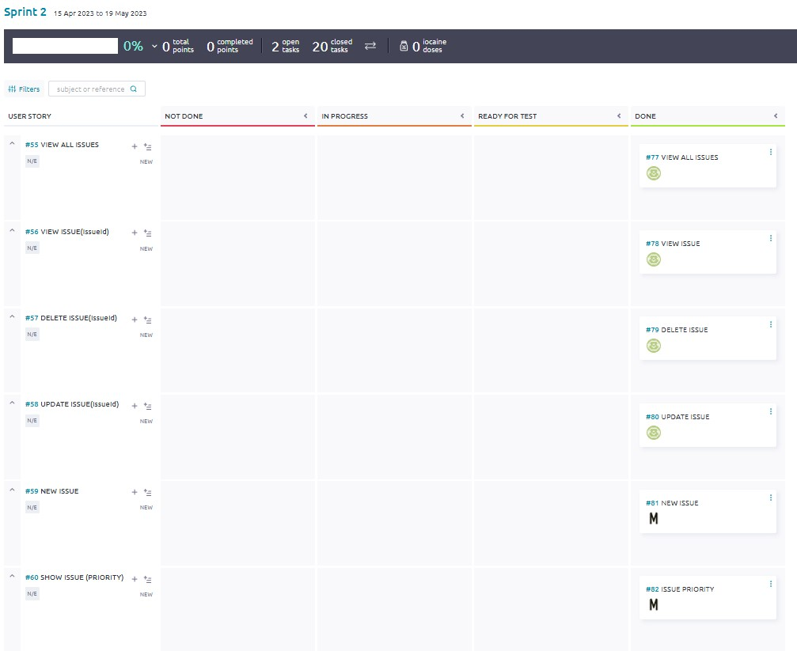

# 🐞 ASW-Project — Taiga Issues Tracker    

<sub>🗓️ Developed in June 2023</sup>  

This project aims to replicate the main functionalities of the **[Taiga Issues Page](https://tree.taiga.io/project/taiga/issues)** in a Rails 7 web application.

---

## ✅ Features

- Basic **Rails 7** app with user login and Google OAuth authentication.
- REST API documented and testable with OpenAPI/Swagger.
- Local development with rails s or rails server -b 0.0.0.0.
- Issue creation with search flters.
- Comments and watchers addition to issues.
- Scrum format tracked through [Taiga](https://tree.taiga.io/project/jowie-asw-11/timeline) (last images in the README).

---

## 🛠 Installation & Setup

### 1. Clone the repository

```bash
git clone https://github.com/marcturu/taiga-issues-like-webapp.git
cd taiga-issues-like-webapp
```

### 2. Install dependencies  
```bash
bundle install
```

### 3. Setup environment variables  
Create a .env file in the project root with:  
```ini
GOOGLE_CLIENT_ID=your_google_client_id
GOOGLE_CLIENT_SECRET=your_google_client_secret
```
 > **Note:**  
 > Get your Google OAuth credentials from your [Google Cloud Console](https://console.cloud.google.com/).

### 4. Setup the database  
```bash
rails db:create
rails db:migrate
rails db:seed # optional if seed data is included
```

### 5. Run the Rails server  
Visually:
```bash
rails s
```
Via API endpoints in the **[Swagger Editor](https://editor.swagger.io/)** with the OpenAPI specification from `/api/api.yaml` and the API key generated from the profile page (if applicable):
```bash
rails server -b 0.0.0.0
```
Access the app at http://localhost:3000.  

---
### Original code at _https://github.com/ASWAIGA_

---

## 📷 Screenshots  

### Main:


-
### Profile:

-
### Create Issue:

-

-

-

-
### API calls (Swagger):  

-
### Taiga:


